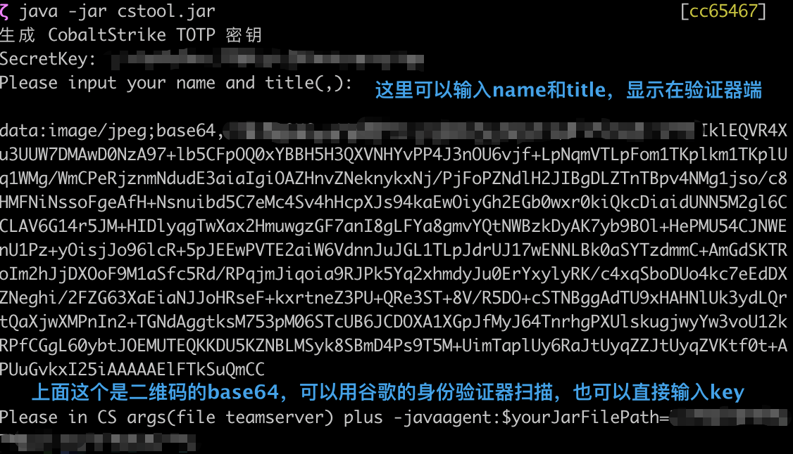
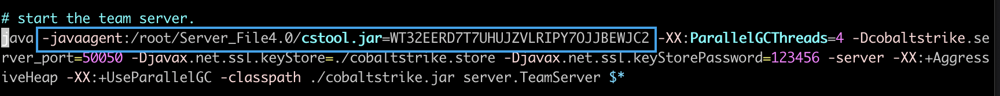

# GoogleAuth

基于cobaltStrike的谷歌二次验证

#### 语言：Java

#### 目的：实现在多人联合中的安全验证

#### 原文：[https://my.oschina.net/u/4587690/blog/5161930](https://my.oschina.net/u/4587690/blog/5161930)

#### 开发原因：很简单，原文没有源代码。也没有jar包，不能“拿来吧你”。所以就自己写算了。

#### 技术栈：Javassist字节码热修改技术（开始是真不懂），Google的zxing的totp验证码

#### 时间：不算长也不算短（4day）

#### 使用方法：

将生成的secretKey按照输出提示加入到teamserver中。

像这样：

最后一切如常，当你登录时，未输入验证码的登录操作会被拒绝并输出Dynamic Code Error.

只有在密码正确并且用户名后加上当时的验证码时才可登录成功。保护一波红队的渗透收集信息。

欢迎各位大佬批评指点，主要是喜欢分享知识学习。

